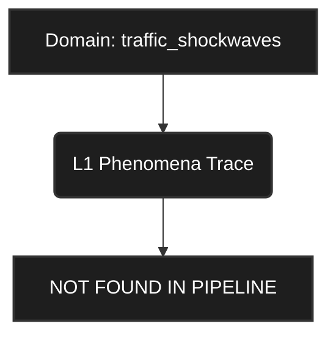

```mermaid
graph TD
  classDef default fill:#1E1E1E,stroke:#333,stroke-width:2px,color:#fff;
  classDef collapsed fill:#8b0000,stroke:#f00,stroke-width:2px,color:#fff;
  classDef success fill:#006400,stroke:#0f0,stroke-width:2px,color:#fff;
  A[Domain: traffic_shockwaves] --> B(L1 Phenomena Trace)
  B --> C[NOT FOUND IN PIPELINE]
```
